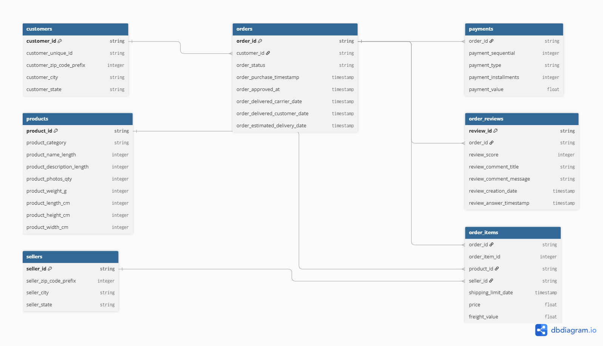
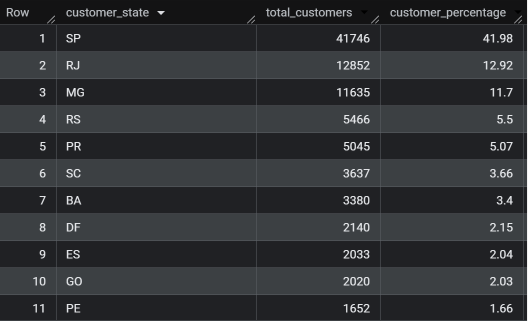
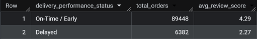
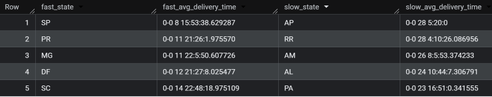
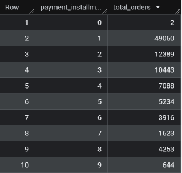
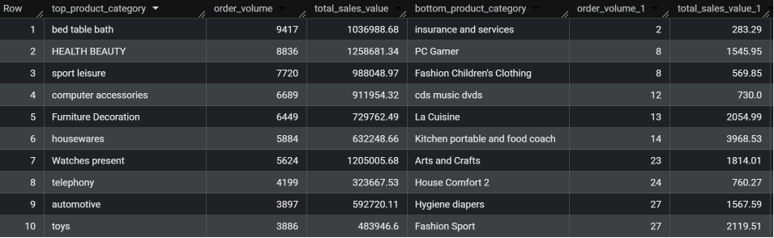
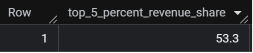

<div align="center">

# 🛒 Target E-Commerce SQL Analysis

[](https://cloud.google.com/bigquery)

</div>

---

## 📌 Business Problem & Key Objectives

In large-scale e-commerce marketplaces, managing cross-regional fulfillment, maintaining customer delivery satisfaction, optimizing checkout conversion rates, and mitigating merchant concentration risks are vital for sustainable revenue growth. 

Acting as a Lead Data Analyst, this project executes advanced BigQuery SQL queries on **Target Brazil's 8-table relational dataset** (spanning 2016 to 2018) to uncover operational inefficiencies and supply chain bottlenecks.

### Core Goals
* **🗺️ Analyze Regional Distribution:** Map order density, revenue patterns, and customer geographic concentration across 27 Brazilian states.
* **🚚 Measure Logistics SLAs:** Quantify actual vs. estimated delivery times and evaluate the direct impact of late fulfillment on customer review scores.
* **💳 Evaluate Payment Behavior:** Examine checkout payment methods, credit card adoption, and consumer reliance on multi-installment financing options.
* **🏬 Assess Merchant Concentration:** Apply SQL window functions (`NTILE`) to determine seller revenue distribution and assess marketplace seller-risk.

---

## 🗄️ Database Architecture & Relational Schema

To analyze Target Brazil's marketplace operations, **8 relational tables** (spanning 100,000+ orders from 2016 to 2018) were ingested into Google BigQuery. 

<div align="center">
  <a href="erd.png" target="_blank">
    
  </a>
  <p><sub>🔍 <i>Click the diagram to open full high-resolution ERD in a new tab</i></sub></p>
</div>

### 📋 Data Dictionary & Table Overview
| Table Name | Description / Primary Key (PK) |
| :--- | :--- |
| **`customers`** | Stores customer unique IDs, location details, city, and Brazilian state code (`customer_id` PK). |
| **`orders`** | Captures order lifecycle timestamps including purchase, approval, carrier dispatch, actual delivery, and estimated delivery dates (`order_id` PK). |
| **`order_items`** | Contains line-item level transaction details, product associations, merchant IDs, item prices, and freight values. |
| **`payments`** | Tracks transaction payment channels (credit card, boleto/UPI, voucher), single vs. multi-installment counts, and total transaction values. |
| **`order_reviews`** | Records customer satisfaction review ratings (1 to 5 stars) and review submission timestamps (`review_id` PK). |
| **`products`** | Stores product catalog attributes including category names, photo quantities, and physical package dimensions (`product_id` PK). |
| **`sellers`** | Contains merchant registration profiles, zip code prefixes, city, and state locations (`seller_id` PK). |

---

## 📊 Key Insights & Visualizations

### 1. State-Level Customer Distribution

<div align="center">
  <a href="screenshots/01_customer_distribution.png" target="_blank">
    
  </a>
  <p><sub>🔍 <i>Click image to expand full query results in a new tab</i></sub></p>
</div>

> [!NOTE]
> * **São Paulo Dominance:** São Paulo (`SP`) represents **~41.98% of total customer volume**, followed by Rio de Janeiro (`RJ`, 12.92%) and Minas Gerais (`MG`, 11.7%).
> * **Fulfillment Hub Alignment:** Supply chain infrastructure and primary distribution centers are heavily concentrated in southeastern Brazil.

---

### 2. Delivery SLA Impact & Regional Speed Disparities

| Delivery Delays vs. Review Scores | Delivery Speed Disparities by State |
| :--- | :--- |
|  |  |
| **SLA Rating Drop:** On-time/early orders maintain an average rating of **4.29 stars**. When deliveries are delayed, review scores drop by **~47% down to 2.27 stars**. | **Geographic Disparities:** Southeastern states benefit from significantly faster fulfillment, whereas northern and northeastern states face prolonged delivery lead times and higher freight rates. |

---

### 3. Payment Financing & Product Demand Skew

| Installment Checkout Behavior | Catalog Revenue & Volume Concentration |
| :--- | :--- |
|  |  |
| **Financing Trends:** Over **48% of transactions** rely on multi-installment payment plans (2 to 10+ monthly payments) to complete purchases. | **Demand Skew:** Top categories like *Bed/Bath* drive ~10,000 orders each, whereas long-tail categories (*PC Gaming*, *CDs*) generate 20 orders total. |

---

### 4. Merchant Concentration Risk (`NTILE`)

<div align="center">
  
</div>

> [!WARNING]
> * **High Seller Reliance:** Utilizing SQL window functions (`NTILE(100)`), the analysis isolated that the **Top 5% of active sellers generate 53% of overall marketplace revenue**. Loss of top-tier merchants presents a severe operational vulnerability.

---

## 💡 Final Conclusion & Strategic Recommendations

> [!TIP]
> ### 🏆 Actionable Business Strategy for Stakeholders
> Based on the data analysis, the following actionable initiatives should be executed to enhance fulfillment efficiency, improve customer retention, and safeguard marketplace revenue:

### 1. Optimize Supply Chain & Regional Logistics
* **Secondary Logistics Hubs:** Build regional distribution centers or partner with localized 3PL providers in remote northeastern states to reduce delivery lead times and lower freight fees.
* **Automated Delay Alerts:** Implement proactive SLA tracking to notify customers before delays occur, mitigating review score drops from 4.29 to 2.27 stars.

### 2. Enhance Checkout & Payment Operations
* **Promote Installment Offers:** Since ~48% of customers rely on multi-installment plans, partner with local financial institutions to offer zero-interest 3-to-6-month installment options during peak holiday sales.

### 3. Merchant Retention & Risk Mitigation
* **Top-Seller Loyalty Program:** Create dedicated account management support and fee incentives for the Top 5% of merchants who drive 53% of GMV to prevent platform churn.

---

## 🛠️ Tools & Tech Stack

```text
Platform & Warehouse :  Google BigQuery (Cloud Environment)
SQL Dialect        :  Google Standard SQL
Advanced Techniques:  CTEs, Subqueries, Window Functions (NTILE, ROW_NUMBER, LAG), Conditional Aggregation (CASE WHEN), Date/Time Arithmetic
Database Architecture:  8-Table Relational Schema (100,000+ Orders)
```

---

## 📁 Repository Structure

```text
target-ecommerce-sql-analysis/
├── data/                                 # Raw relational CSV datasets
│   ├── customers.csv
│   ├── order_items.csv
│   ├── order_reviews.csv
│   ├── orders.csv
│   ├── payments.csv
│   ├── products.csv
│   └── sellers.csv
├── queries/                              # Categorized BigQuery Standard SQL scripts
│   ├── 01_exploratory_data_analysis.sql
│   ├── 02_order_trends_and_seasonality.sql
│   ├── 03_regional_distribution_and_economics.sql
│   ├── 04_logistics_and_delivery_performance.sql
│   ├── 05_payment_behaviors.sql
│   └── 06_product_and_seller_analytics.sql
├── screenshots/                          # Visual BigQuery query output grids
│   ├── 01_customer_distribution.png
│   ├── 02_delivery_vs_reviews.png
│   ├── 03_freight_and_delivery_by_state.png
│   ├── 04_payment_installments.png
│   ├── 05_top_bottom_categories.png
│   └── 06_seller_concentration.png
├── erd.png                               # Entity Relationship Diagram (ERD)
└── README.md                             # Project documentation
```

---

## 🚀 How to Run the Project Locally

1. **Clone the repository:**
   ```bash
   git clone https://github.com/Kash4Code/target-ecommerce-sql-analysis.git
   cd target-ecommerce-sql-analysis
   ```
   
2. **Set Up Google BigQuery**
   * Open the Google BigQuery Console.
   * Create a new dataset named TARGET_SQL.
   * Import the 7 CSV files located in the data/ directory into your TARGET_SQL dataset.
   
3. **Execute Analysis Queries**
   * Open BigQuery Studio.
   * Create a new dataset named TARGET_SQL.Copy any .sql script from the queries/ directory into the query editor.
   * Click Run to view the analytical results.

---

## 🌟 Support & Feedback

If you found this project helpful or insightful, please consider **starring** ⭐ the repository and **forking** 🍴 it to build upon it!

Have suggestions or feedback? Feel free to open an issue or connect with me:

[](https://github.com/Kash4Code)
[](https://www.linkedin.com/in/kashinathrp/)
